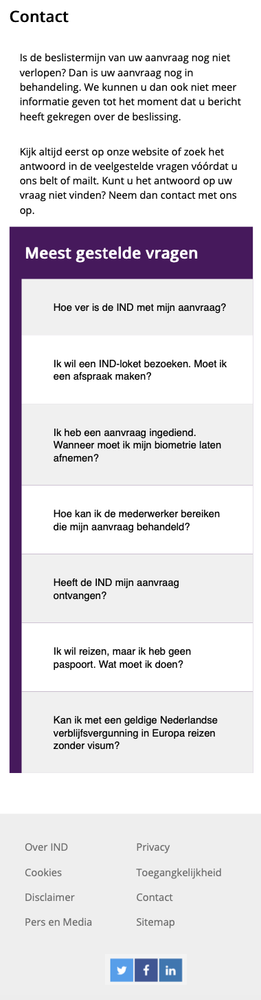

# Procesverslag
**Auteur:** 
-Nine Revius-

Markdown cheat cheet: [Hulp bij het schrijven van Markdown](https://github.com/adam-p/markdown-here/wiki/Markdown-Cheatsheet). Nb. de standaardstructuur en de spartaanse opmaak zijn helemaal prima. Het gaat om de inhoud van je procesverslag. Besteedt de tijd voor pracht en praal aan je website.

## Bronnenlijst
1. https://www.w3schools.com/howto/howto_css_searchbar.asp
2. https://medium.com/@zac_heisey/      7-alternatives-to-the-div-html-tag-7c888c7b5036
3. https://www.w3schools.com/howto/howto_js_accordion.asp
4. https://www.creativebloq.com/how-to/create-a-responsive-layout-with-css-grid

## Eindgesprek (week 7/8)

Ik vond het toch wel ontzettend lastig om alles op de juiste plek te krijgen en menu's laten te verdwijnen en te laten zien. Omdat mijn kennis van code nog erg beperkt is merk ik dat ik vaak niet zo goed weet waar ik naar moet zoeken. Zo heb ik vaak om feedback gevraagd bij mijn medestudenten en ben ik er dan wel enigszins uit gekomen. Persoonlijk vind ik het met code erg frustrerend dat je uren kan zitten aan iets zonder resultaat. 

**Screenshot(s):**

Screenshots hoofdpagina

Screenshots van de tweede pagina

## Voortgang 3 (week 6)

Bij het voortgangsgesprek kwam eruit voort dat ik goed m'n best moest doen op vanilla html/css. 
Zo ben ik in mijn css titels gaan geven om overzicht te creëren in welke sectie zich waar bevindt. 
Alle linkjes hebben nu een # en de namen die voorheen niet netjes of onduidelijk waren heb ik aangepast zodat
dit helder blijft om voor anderen en mezelf te lezen. Tot slot heb ik alle id's eruit gegooid en vervangen door class's Verder heb ik met behulp van Javascript wat menu's weten klikbaar te maken maar ben ik wel vaak tegen foutjes aangelopen. Zo heb ik uren gezeten aan het menu van het inlogscherm wat telkens niet deed wat ik wilde, eerst heb ik het geprobeerd in CSS en daarna ben ik overgestapt op Javascript waar hij uiteindelijk ook mee doet. Ik ben mijn code nagelopen en wil deze nog voor het eindgesprek even laten controleren door klasgenoten om de laatste feedback te kunnen verwerken. 

## Voortgang 2 (week 5)

### Stand van zaken

Wat ging er goed?

Op advies van Victor nog even met Javascript het menu wat mooier laten sluiten. Daarnaast de juiste elementen in de header zetten, omdat er nu veel in sections staat. Hamburger menu werkt nog niet bij de afspraak website, die moet nog werken. 

**Screenshot(s):**

## Voortgang 1 (week 3)

### Stand van zaken

Wat ging er goed?
Het ging nog best goed om de opzet een beetje te maken.

Wat ging er minder goed?
Bij sommige stukjes code was het beter geweest als ik dergelijke dingen in bijvoorbeeld sections had moeten zetten. 
Ik vind het bestwel moeilijk om de juiste handelingen te weten en vraag daarom ook veel hulp aan mijn medestudenten.

**Screenshot(s):**

Op dit moment heb ik het eerste gedeelte een beetje op kunnen zetten. In principe is de website van de IND nog best te doen en denk ik dat dit een goede keus is voor mijn kunnen.

### Agenda voor meeting

-samen met je groepje opstellen-

| student 1      | student 2          | student 3    | student 4        |
| ---            | ---                | ---          | ---              |
| dit bespreken  | en dit             | en ik dit    | en dan ik dat    |
| an dat ook nog | dit als er tijd is | nog een punt | dit wil ik zeker |
| ...            | ...                | ...          | ...              |

### Verslag van meeting

Redelijk op wel, let goed op de manier hoe je dingen neerzet. Gebruik de juiste code voor wat je nodig hebt. 

## Breakdownschets (week 1)

-uitwerken voor de 1e werkgroep - eind van de eerste week-
Voor de eerste week heb ik de website van de IND uitgewerkt in de breakdownschets. 

De resultaten van het huiswerk van Codepen.

## Intake (week 1)
-uitwerken voor de kick-off werkgroep - begin van de eerste week-

**Je startniveau:** -blauw-

**Je focus:** -surface plane-

**Je opdracht:** -https://ind.nl/Paginas/home.aspx-

**Screenshot(s) van de eerste pagina (small screen):**

**Screenshot(s) van de tweede pagina (small screen):**

